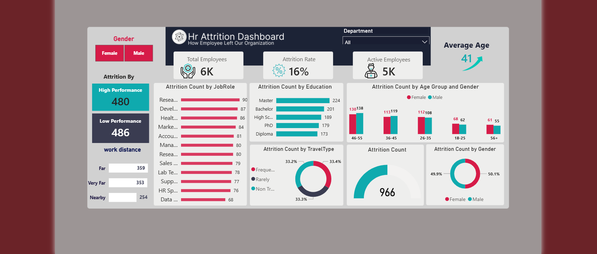

# Powerbi-hr-attrition-dashboard
Interactive HR Attrition# 📊 HR Attrition Analysis Dashboard | Power BI

## 📌 Project Overview
This project is an interactive HR Attrition Dashboard built using Power BI to analyze employee turnover and workforce trends. It provides insights through interactive visualizations, KPIs, and dynamic filtering to support data-driven decision-making.

## 🎯 Objectives
- Analyze employee attrition patterns.
- Identify workforce trends.
- Build an interactive HR dashboard.
- Practice data modeling and DAX.

## 🛠 Tools & Technologies
- Power BI
- Power Query
- DAX
- Star Schema Data Modeling

## 📊 Dashboard Features
- Workforce Overview
- Attrition Rate
- Department Analysis
- Job Role Analysis
- Education Analysis
- Business Travel Analysis
- Work Distance Analysis
- Gender & Age Analysis
- Performance Analysis

